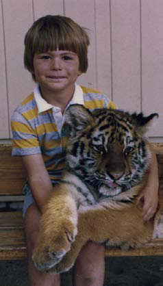

**Roar for the Camera?**

****

Russian circuses, in an act that would shock most U.S. parents and child-safety officials, commonly offer photo-ops with children and trained animals. “Don’t worry, it’s just a little kitty,” one parent reassured his child.

Russians are known for their brio (just look at Putin’s antics). But tigers are something to admire from a safe distance—particularly in South and Southeast Asia, where they have killed at least 373,000 people over the past 200 years.

*—Diane Richard, writer*

*July 16*

Photo: James Hill for *New York Times    *Above image of MIA staffer

Source: Andrew Kramer, *New York Times*, July 11, 2013 

