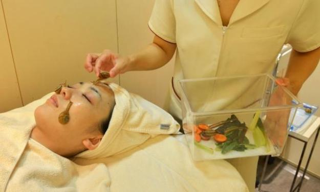

**Mollusk-mucus Mask?**

****

A Tokyo spa is now marketing a new facial treatment involving the use of live snails and their slime. The hour-long service, which costs about \$245, is intended to make skin look more youthful. Hardly the first odd beauty panacea, the medicinal use of snails dates back to 400 BCE to conquer skin inflammation. What’s more, geishas and Victorian queens famously—sometimes fatally—applied toxic lead to whiten their complexions. 

Many depictions of the Buddha, like this one here, feature a cranium covered with snails, a symbol of his patient reflection while sitting under the Bodhi Tree. Somehow *he* always retained his youthful glow.

*—Diane Richard, writer*

*July 25*

**

Photo: *Telegraph*

Source: “Japan Clinic Launches ‘Snail Facial,’” *The Telegraph*, July 13, 2013 

