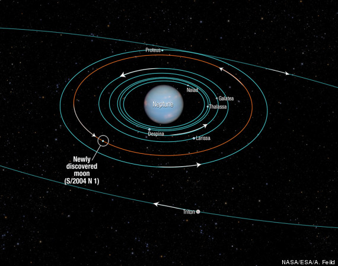

**Up for a moondance?**

****

Scientists have recently discovered a new moon orbiting Neptune. Designated S/2004 N 1, it is the smallest of Neptune’s 14 moons and has avoided detection until now because it orbits the planet near two larger moons, Proteus and Larissa, in a zippy 23 hours flat.   

Meteors like those rocketing around Jennifer Steinkamp’s *6EQUJ5* have also been be found orbiting moons and planets. And if you watch these multi-colored missiles long enough, you too might discover a new moon. 

*—Christopher Atkins, curator*

*July 26, 2013*

Photo credit: NASA

News source: huffingtonpost.com/2013/07/15/new-neptune-moon-smallest-photos\_n\_3600177.html

