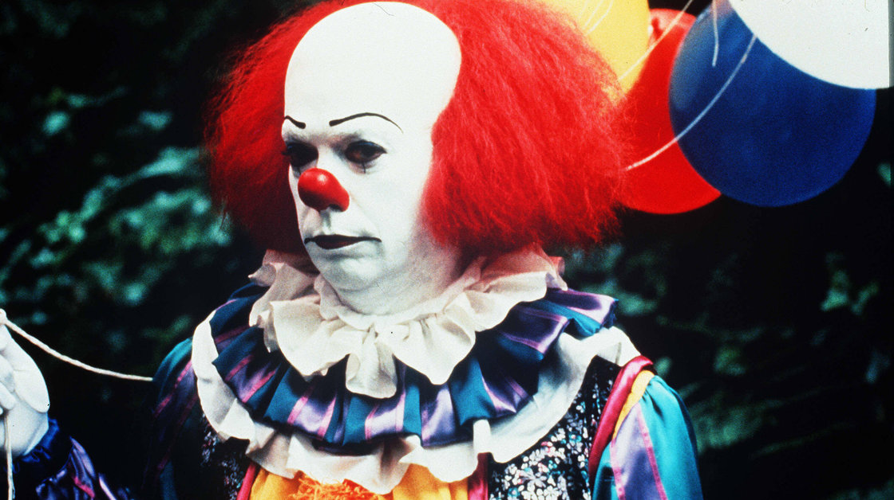

**No Laughing Matter?**

****

A recent report supports what you probably already know: clowns are indeed scary for many.

Cultures around the world use masks in ritual performances. Increasingly, however, such masquerades have a disquieting effect in Western society. Scandals involving some clowns’ decidedly unfunny behavior might be one reason. Says the researcher: “…I think at the end of the day, a lot of the fear of clowns actually comes back to the person underneath the makeup.” *—Diane Richard, writer*

*August 14*

**

Photo: The Kobal Collection

Source: Linda Rodriguez McRobbie, “The History and Psychology of Clowns Being Scary,” *Smithsonian Magazine*, August 2013 

