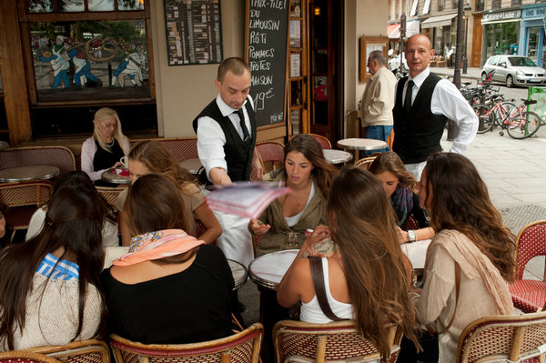

**Adieu to the unfriendly Frenchman?**

****

The gruff Gallic waiter and the petty Parisian hotelier loom as large in the tourist imagination as the Eiffel Tower. Who cares if they’re as unreal as Tintin? The Paris tourism board, that’s who. It’s distributed tens of thousands of brochures called “Do You Speak Touriste?” to cafes, hotels, and shops in an effort to snub out *snobisme*and put a premium on politesse, advising that Americans just like eating at 6 p.m. (and can’t be unglued from their phones) and the British like being addressed by their first names. 

What’s at stake? Billions of tourism dollars. And perhaps one of the primary reasons to travel: to be somewhere different from home. *C’est la vie*.

*—Tim Gihring, editor*

*August 21, 2013*

Source: *New York Times*, August 20, 2013

