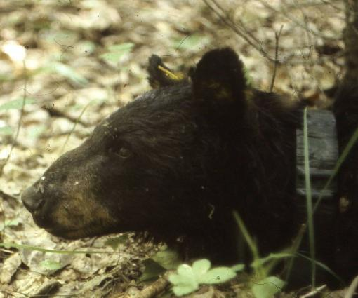

**A Bear-ing of Gifts?**

****

To foster a peaceful coexistence between humans and natural habitat, Minnesota’s Department of Natural Resources has collected data from collared bears for over 30 years. By studying the collared bears, the DNR is able to track feeding habits, reproduction, and aging.

The bear longest tracked by the DNR, Bear No. 56, recently died. In her nearly 40 years, she gave birth to eight litters—or 22 individual cubs, 21 of which survived their first 18 months before reaching independence. She reportedly died of old age in a shaded area well suited to a restful bear nap.

*—Jessica Naithani, D & E Project Coordinator, August 28*

**

****

****

Photo: DNR

Source: Paul Walsh, *Star Tribune*, “World's oldest wild bear dies in Minnesota forest, August 27, 2013. 

