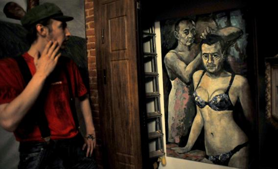

**A Petticoat Too Far?**

****

St. Petersburg police recently plucked a provocative painting of Russia’s President and Prime Minister in women’s lingerie from a local art gallery, citing it had broken unidentified laws. Many wonder whether authorities will invoke this summer’s gay “propaganda” law banning the distribution of such materials in Russia.

Presenting your enemies as effeminate and/or transgressive is nothing new, as this 1865 “snake jug” makes clear. It depicts Jefferson Davis, president of the Confederate States, in women’s attire, which he reportedly donned to escape capture by Union troops. 

-   *Alex Bortolot, Content Strategist, August 28*

**

**

**

Joshua Keating, “Police Remove Painting of Putin and Medvedev in Women’s Underwear From Russian Art Gallery,” Slate.com, Aug. 27. Photo: Olga Maltseva/AFP/Getty Images

