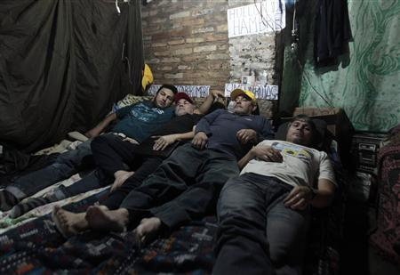

**Literal cross to bear?**

****

In an act heavy with symbolism, eight Paraguayan bus drivers, along with several of their wives, have had themselves nailed to crosses to protest being fired after complaining of low wages. (Fortunately, the photograph shows only the “before” image.) 

The drivers have remained on the wooden crosses for more than two weeks. The bus company said it would restore some of their jobs and find new jobs for others, but the drivers in solidarity have refused until all are invited back. *—Diane Richard, writer, September 4*

**

**

**

Photo: Reuters/Jorge Adorno

Source: JACKIE CALMES, “Fired Paraguayan bus drivers have themselves nailed to crosses,” *Reuters*, August 30, 2013 

