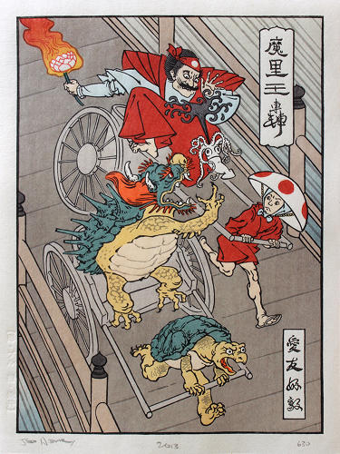

**21st Century *Ukiyo-e*?**

****

American illustrator Jed Henry and British craftsman David Bull have reinvigorated the *ukiyo-e* genre of Japanese woodblock printing for a 21st century gaming audience. A wild success on Kickstarter (the *Ukiyo-E Heroes* project is still the most successful in the site’s history), Henry’s reimagining of video game characters as art tropes of medieval Japan has captured the imagination of art and gaming nerds alike.

*—Courtney Algeo, brand communications specialist*

*September 3*

****

Source: John Brownlee, “How Video Games Revived The Dying Art Of Japanese Woodprinting,” *Fast Company*, August 28, 2013

