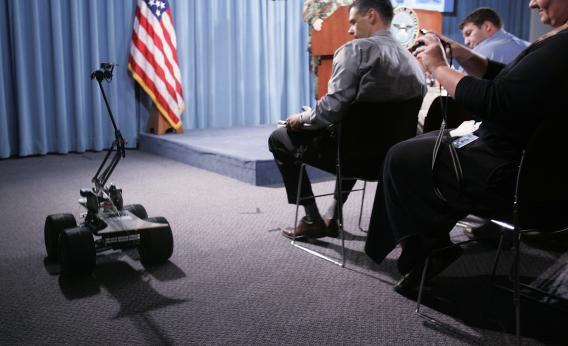

**Soldiers + Robots = Love?**

****

All’s fair in love and war. But what happens when emotions and battle tactics collide? It’s a question researchers are asking about U.S. soldiers and the robots they use in places like Afghanistan. Soldiers say they see robots as mere machines, but sometimes their behavior suggests otherwise—that on some level they’re treated as pets or fellow combatants.

Soldiers have always had close ties to those who assist them on the battlefield. Need evidence? Take Alexander the Great, portrayed here astride his beloved horse Bucephalus. *—Alex Bortolot, Content Strategist, September 26*

**

**

Image: Chip Somodevilla/Getty Images

Source: Katy Waldman, ”Are Soldiers Too Emotionally Attached to Military Robots?” salon.com, 9/20/13 

