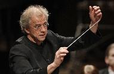

**Sound of silence?**

****

Osmo Vänskä, the acclaimed conductor of the Minnesota Orchestra, made good on his promise to resign if the gridlock between management and players kept up. His line in the sand was two Carnegie Hall concerts in November, put in peril for lack of rehearsal time.

Already over a year long, the orchestra lockout has left many to wonder what’s next for the world-renowned hometown orchestra? The Minnesota Orchestra earned Grammy nominations in 2008 and 2012 for its recordings with Vänskä of symphonies of Beethoven (No. 9) and Sibelius (Nos. 2 & 5). Bum, bum, bum BAH.     *—Diane Richard, writer, October 2*

**

Photo: *Star Tribune* 

Source: GRAYDON ROYCE, “Osmo Vänskä’s Departure Shakes Minnesota Orchestra,” *Star Tribune*, October 2, 2013 

