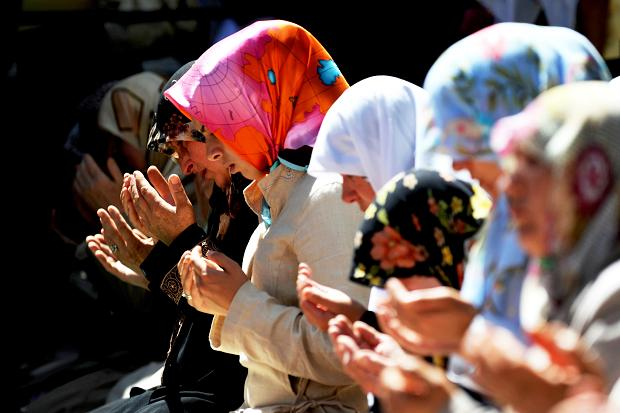

**Turkish Pandora’s box?**

****

In journalism, three of anything makes a trend. But what to make of this October trio? First was a lifting of a headscarf ban on female civil servants; such observant Muslim wear was long outlawed under Turkey’s secular government, but no longer under its current leadership. 

Then came the firing of a TV newsreader for showing too much cleavage on air. Most recently, we learn that after 85 years the letter Q has been reinstated to the Turkish alphabet. When Atatürk imposed the Latin script on the Turkish language in 1928, it made sense to weed out seldom used letters, like Q, W, and X, to add others like ğ, ı, ü, and ş.     *—Diane Richard, writer, October 23*

**

Image: Alexander Christie-Miller in Istanbul and Jenny Booth

Sources: “Turkey’s headscarf ban lifted in assault on the secular state,” The Times, October 1; Marc Champion, “Turkey Cracks Down on Cleavage,” *Bloomsberg*, October 9, 2013; Yasmine Seale, “Q vs. K,” *London Review of Books* blog, October 16, 2013

