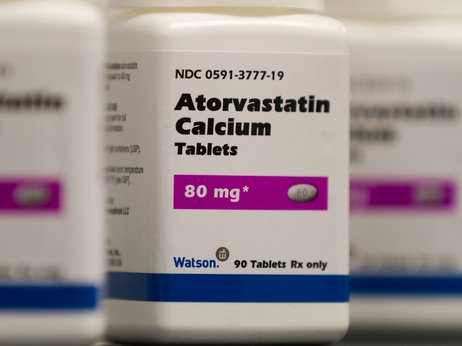

**Where’s the beef?**

****

Good news for those who struggle to give up high cholesterol foods and for drug companies that make statin meds: Popping pills may be the only reliable way to reduce LDL or “bad” cholesterol levels. 

Research shows changes in diet have a limited effect on cholesterol levels over time. This week, the American College of Cardiology and the American Heart Association released new guidelines that may result in doubling the number of Americans on lifelong regimens of drug therapy. Will the new guidelines’ endorsement of statin medication be interpreted by the public as a license to eat more burgers and fries?          

*   —* *Amanda Thompson Rundahl, educator, November 13*

**

Photo: Bill Gallery/ASSOCIATED PRESS

Source: Richard Knox, “A shift in cholesterol advice could double statin use,” *National Public Radio,* November 13, 2013 

