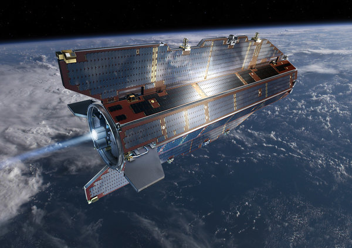

**Down with Space Junk?**

****

Evidently so: just last weekend, a 1-ton European satellite ran out of juice and plummeted to Earth, breaking up into tiny pieces that peppered the South Atlantic Ocean like a big Caesar salad.

It’s yet another instance of a trend worrying scientists: the unpredictable re-entry of space flotsam into the earth’s atmosphere. 100 tons of the stuff is expected to fall on us earthlings this year alone. 

*—Alex Bortolot, Content Strategist, November 13*

**

Image: An artist's depiction of the European Space Agency’s Gravity Field and Steady-State Ocean Circulation Explorer satellite in orbit.

Source: Kenneth Chang, “Satellite Falls to Earth,” *New York Times*, 11/6/13 

