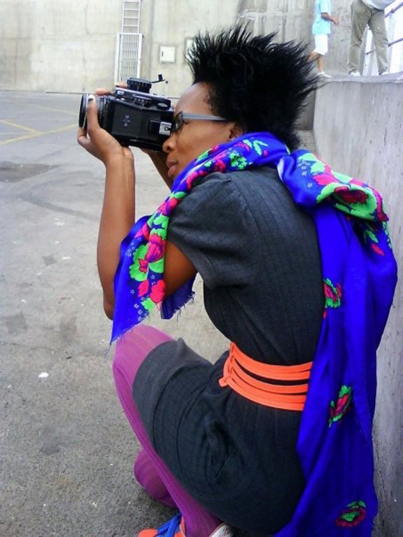

**Art and activism: Nelson Mandela’s cultural legacy**

****

Political freedom and artistic freedom go hand in hand, and black artists in South Africa galvanized the opposition to apartheid in the 1980 and ’90s, setting up Nelson Mandela for success. Today, the so-called “born free” generation of South African youth, coming of age post-apartheid, are expressing themselves through fashion and culture to project an image based not on the judgment of others but their own prerogatives. South African artists like Lolo Veleko (shown below) are chronicling this change, this experimenting with identity, one more way that Mandela’s legacy will linger.

*—Tim Gihring, editor*

*December 7, 2013*

