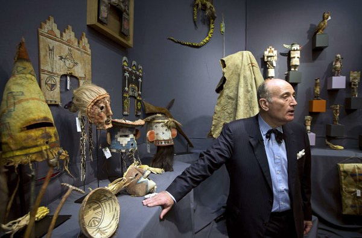

**Scheme to honor the Hopi?**

****

The December sale of sacred Hopi artifacts, held in Paris, highlighted deeds both noble and, some would argue, ignoble. The Annenberg Foundation conspired to purchase 27 tribal objects, keeping the plans secret from even the Hopi. Staff members worked covertly with a Paris lawyer to bid on the auction. Meanwhile, members of the Hopi, watching the sale online, bade goodbye to the spirits they believe embody each mask. 

Hours later, the Hopi learned of the scheme, which will result in all but three of the 24 Hopi objects to be returned to the tribe. Plus, a couple had purchased one other with the same intent. *—Diane Richard, writer, December 18*

**

**

Image: Joel Saget/Agence France-Presse — Getty Images

Source: TOM MASHBERG, “Secret Bids Guide Hopi Indians’ Spirits Home,” *New York Times*, December 16, 2013 

