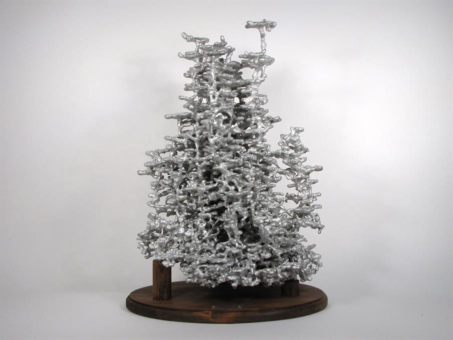

**Ant art: beautiful or cruel?**

****

His art is spectacular, like an undersea ice sculpture, and so is the way he makes it: by pouring molten aluminum into an anthill. He lets it seep into the multitudinous chambers, then carefully digs it out, hosing off what remains of the anthill. 

Trouble is, for those who are troubled by such things, there aren’t any ants left. The anonymous artist is hardly the first to incorporate insects in his work, like the Dutch still life masters here. But it comes at too steep a price for those who dumped bile on a recent viral YouTube video of his process. The most common comment: “What if I poured aluminum in your house?”

*—Tim Gihring, editor*

*December 20, 2013*

Source: anthillart.com

