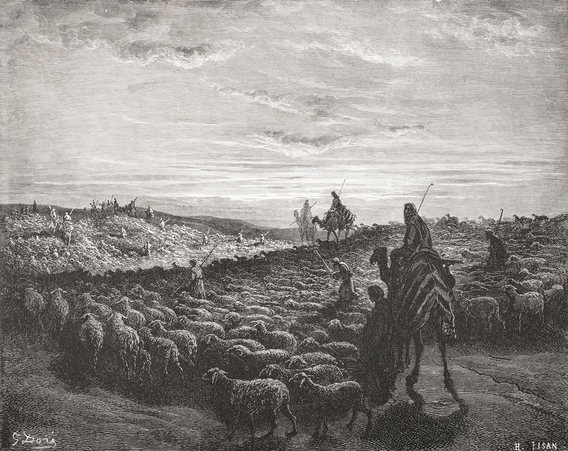

**Why are there camels in Genesis?**

****

The Biblical Jewish patriarchs—Abraham, Isaac, and Jacob—got around on camel. At least in the Bible, where dromedaries are mentioned 47 times, mostly as a mode of transport. Artworks like the 19th century engraving below show Abraham riding into Canaan on a camel. 

But recent carbon-dating of ancient camel bones suggests the beasts weren’t burdened with domestication until nearly a thousand years after the patriarchs are generally agreed to have lived. Meaning Biblical authors likely filled in stories with details drawn from their own, much later time, leaving the real means of the Israelites’ nomadic wanderings up for grabs.

*—Tim Gihring, editor*

*February 12, 2014*

Source: National Geographic, February 10, 2014

