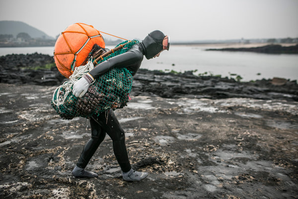

**Korea’s divers plunging?**

****

For generations, women native to an island of South Korea have braved the treacherous waters and frigid temps to make a living and support their families. Today, they are the last of a dying breed.

The women, known as *haenyeo*, or “sea woman,” scour the sea bottom—without respirators—for octopus, abalone, and conch. Wetsuits have only made the job more grueling and dangerous. Since 2009, 40 divers have died. Once numbering 26,000 in the 1960s, the population has plunged to 4,500. Their daughters and grand daughters prefer to work at the island’s resorts. *—Diane Richard, writer, April 4*

**

Image: Jean Chung for the *New York Times*

Source: CHOE SANG-HUN, “Hardy Divers in Korea Strait, ‘Sea Women’ Are Dwindling,” *New York Times,*March 29

