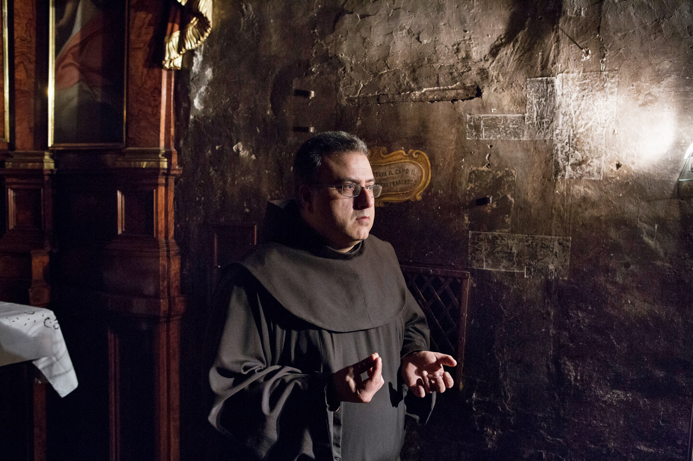

**Kickstarting Franciscans?
**

Above St. Francis at Ripa, an 800-year-old Franciscan church in Rome, you’ll find a deteriorating cell, equipped with a stone pillow, where Saint Francis of Assisi (depicted in the panel at left) often stayed. 

To raise the \$125,000 needed to restore the room, the friars—known for their centuries-long vows of poverty and dependence on charity—are updating their fund-raising strategies. They’ve turned to Kickstarter, the electronic crowd-sourcing investment site. The campaign runs out on April 11. If it doesn’t reach the full amount, all proceeds will be returned to the funders. Godspeed, friars!
 *—Emma Bauer, Audience Engagement Assistant, April 3*

Image: Gaia Pianigiani
 Source: Jim Yardley, “Centuries-Old Church Passes a Digital Collection Plate” *New York Times*, April 2.

