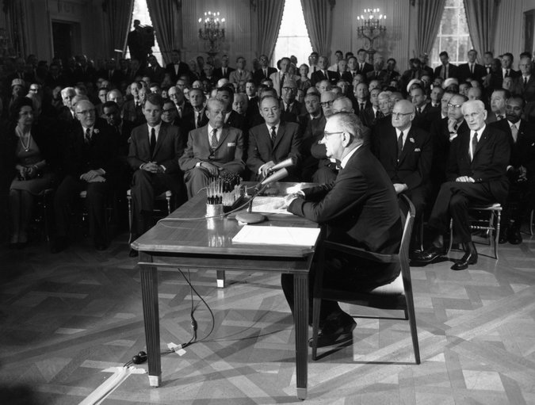

**50 Years of Civil Rights**

****

In 1947, civil rights icon Jackie Robinson was the first African American athlete to be signed by a Major League Baseball team, thereby breaking the color barrier.

This week, the nation celebrates the fiftieth anniversary of the Civil Rights Act, signed by President Lyndon B. Johnson. The 1964 act outlawed discrimination based on race, color, religion, sex, or national origin. It ended unequal application of voter registration requirements and racial segregation in schools, the workplace, and public facilities. Three ex-presidents and President Obama will honor the occasion with speeches at LBJ’s presidential library in Austin, Texas. *—Diane Richard, writer, April 10*

Image: Keystone/Getty Images

Source: Peter Baker, “For Obama Presidency, Lyndon Johnson Looms Large,” *New York Times,*April 8

