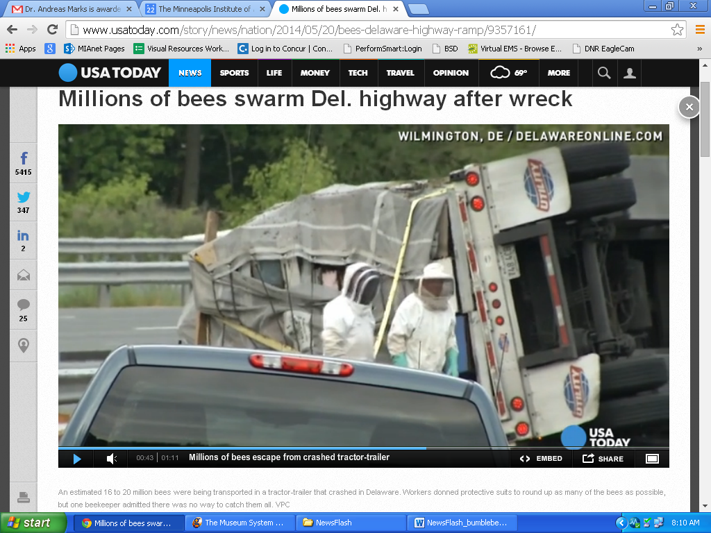

**A Bumble Fumble?**

****

This week, 16 to 20 million honeybees were accidentally released when a truck transporting them toppled over on a Delaware highway.

Beekeepers and firefighters assessed the sticky (and stingy!) swarm situation. Ultimately, they figured the best course of action was to allow the bees to buzz off, hosing them away with water. 

*—Roma Rowland, Administrative Assistant*

*Departments of Asian Art and Japanese & Korean Art*

*May 22*

Photo credit: USAToday/ Delawareonline.com

Source: Robin Brown, “Millions of bees swarm Del. highway after wreck,” *USA Today,*May 21

