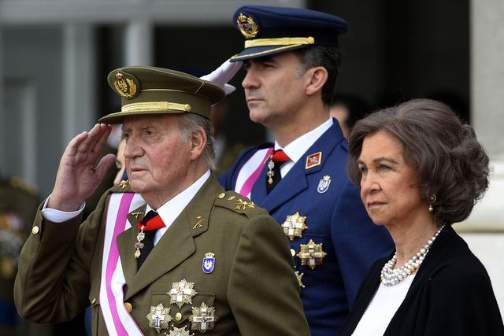

**The reign in Spain?**

****

If Goya, court painter to the Spanish monarchy, were alive now, he’d be gasping for breath at the news of King Juan Carlos of Spain’s abdication of the throne.

A survivor of World War II and the reign of Franco, King Juan is flailing at scandal that surrounds the crown, including a son-in-law accused of embezzlement. His own conduct hunting elephants in Africa while recovering from hip surgery—as Spain’s economy plummeted—also haunts his legacy. His son Felipe will assume the throne, though a skeptical Spanish public is left wondering what’s next.   *—Diane Richard, writer, June 4*

**

Image: Gerard Julien

Source: Raphael Minder, “New King or, Spaniards Ask, Is It Time for No King?,” *The New York Times,*June 2

