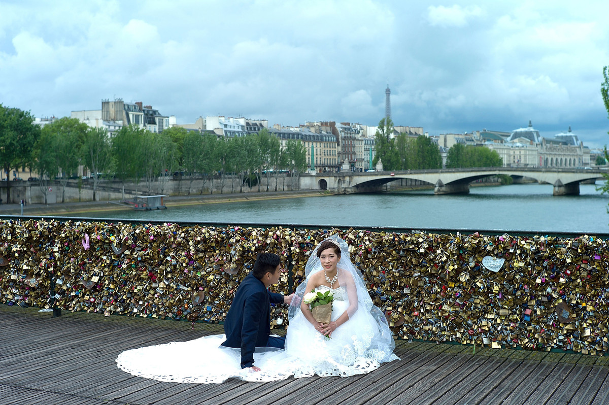

**Update: Locks of Love? **

****

An expression of love has transformed the bridges of Paris, famed for their beauty, into a public eyesore. Worse, in June the weight of the locks caused a bridge rail to collapse, forcing pedestrians to flee.

For several years now, lovers from around the world have proclaimed their ardor with the click of a padlock along the metalwork of their favorite bridges. What seemed like a quaint idea has metastasized into a preservationist problem. Recently, police were forced to shoo visitors off a central Paris footbridge burdened under the weight of so many tokens of affection.   *—Diane Richard, writer, June 11*

**

Image: Pierre Suu/Getty Images

Source: Agence France Presse, “'Locks Of Love' Bridge In Paris Evacuated After Railing Collapses,” *The Huffington Post,*June 9

