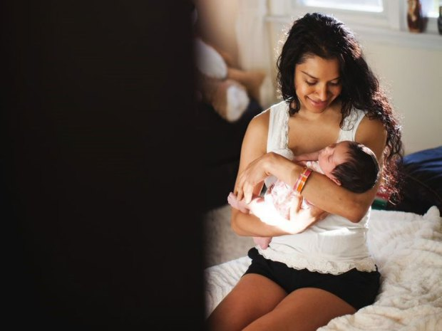

**Your personal paparazzi?**

****

Are you still taking your own photos? How 1865–2013 of you. Are you still asking strangers to take photos of you? How…trusting. Or maybe you didn’t realize that you could hire a team of photographers to follow you around, documenting your everyday life, and that would be totally normal—perhaps.

Yes, it’s no longer enough to hire pros to shoot your wedding, your bar mitzvah, or your baby’s first birthday. For \$229, photographers from I Heart New York will traipse after you as you go about your business for a couple hours—and a lot of people are taking such companies up on this. You can even post the images instantly on social media: your not-so-real reality show. 

*—Tim Gihring, editor*

*June 12, 2014*

Source: Associated Press, June 10, 2014

