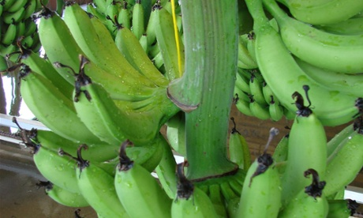

**Vitamin vision for Uganda?**

****

In East Africa, thousands of children go blind each year due to malnutrition and vitamin A deficiency. 

Recently, scientists have found a way to genetically modify a banana, high in vitamin A and other nutrients, that could easily be grown and harvested within these African communities. It is hoped that the GMO will help solve preventable blindness in an area where many children don’t even make it to their sixth birthday. Talk about an appealing way to solve world hunger.

*—Roma Rowland, Administrative Assistant*

*Departments of Asian Art and Japanese & Korean Art*

*June 20*

Image: ABC

Source: Australian Associated Press, “Scientists bend banana genome to help children overcome vitamin A deficiency,” *The Guardian,*June 15

