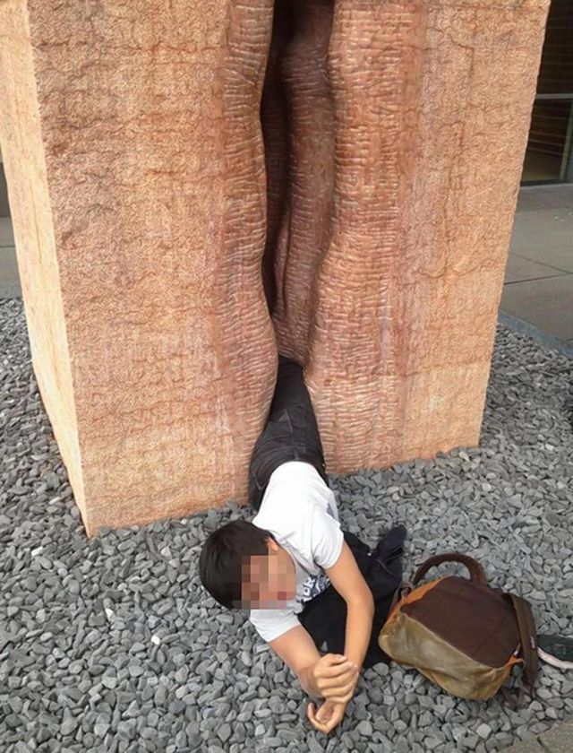

**How into art are you?**

****

This week, an American foreign exchange student in Germany served as a reminder to art enthusiasts everywhere. While attempting to get a “funny” tourist photo, he fell into a large, 13-ton sculpture of a vulva;
 it took 22 firefighters to remove him. 

Touching, or, worse, getting stuck in a work of art not only can be dangerous and cause physical harm, but it can also be mortifying and make international news. Think twice before sticking your hands (or your entire body) into the art!    

*—Roma Rowland,
 Administrative Assistant*
 *Departments of Asian Art
 and Japanese & Korean Art*, *June 25*

Image: ERICKGUZMAN VIA IMGUR

Source: LEE MORAN, “American student rescued after getting stuck in giant vagina sculpture in Germany,” Daily News, June 23, 2014

