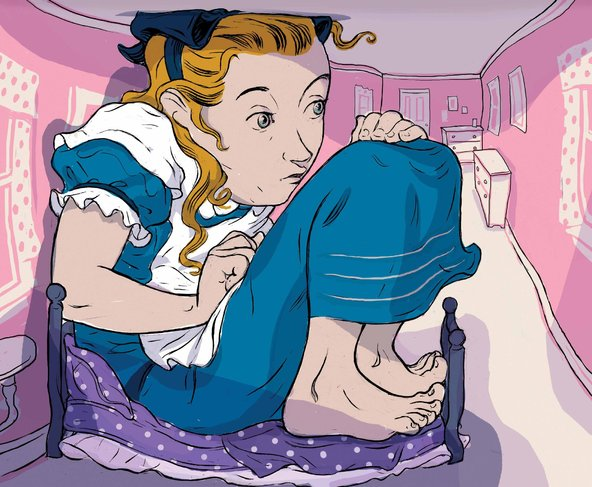

**Objects may be closer than they appear**

****

New research is uncovering the neuroscience behind a condition known as “Alice in Wonderland Syndrome.” First described in 1955, it involves a visual illusion in which objects or body parts appear unusually large (*macropsia*) or unusually small (*micropsia)*—what Alice experienced in Lewis Carroll’s classic children’s book, *Alice’s Adventures in Wonderland*.

Scientists note that the syndrome is most commonly experienced by children, and likely generates in the parietal lobe, which processes environmental and spatial information. It often precedes migraines.

    *—Katie Wildfong, *

*Family & Teen Programs, June 25*

Image: Lars Leetaru

Source: Helene Stapinski, “I Had Alice in Wonderland Syndrome,” *The New York Times*, June 23, 2014

