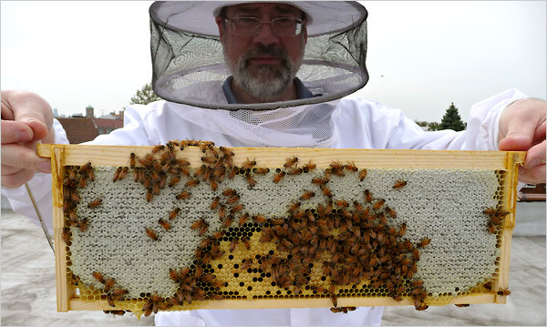

**Why all the buzz about bees?**

****

Bees are suddenly everywhere—on the cover of *TIME*, the front page of the *New York Times*, and other media around the world—because they’re suddenly nowhere.
 A mysterious malady has reduced honeybee colonies by 30 to 50 percent every year since 2006, threatening many fruits and vegetables, not to mention honey.

The MIA has responded by hosting four bee colonies on its roof, celebrating the longstanding connection between art and nature exemplified in this Art Nouveau pitcher (note the bee crawling around the corn husk). You’ll also find bees on a clock in gallery G334 and on Third Thursday, August 15, here at the museum, as Andrew Zimmern’s AZ Canteen food truck serves honey fresh from the bees on our bonnet.

*—Tim Gihring, editor*

*August 14, 2013*

Source: New York Times, August 6, 2013

