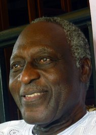

**A poet mourned**

****

Among the victims of the recent Nairobi mall attack was Kofi Awoonor, one of Ghana’s most famous poets.

Every individual killed or injured by the perpetrators of the violence is to be grieved. Still, the death of Awoonor reminds us of how poets, scholars, ambassadors, and cultural luminaries are as mortal as the rest of us. And of how easily our lives can be snuffed out, doing something as human as sipping coffee in a mall café. *—Diane Richard, writer, September 25*

**

Photo: Agence France-Press — Getty Images 

Source: ADAM NOSSITER, “Ghanaians Mourn a Poet and Scholar Killed in Nairobi Mall Attack,” *New York Times*, September 23, 2013 

