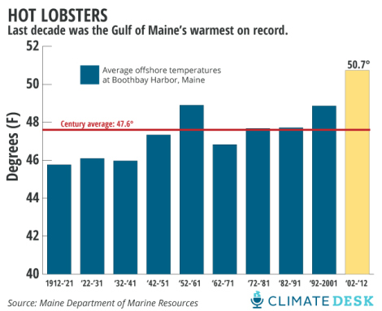

**Sex, Telephones, and Lobster Cannibalism?**

****

Warming waters off the Gulf of Maine are resulting in increased fecundity of lobsters. Climate change has also forced the crustacean’s natural predators further offshore. The shocking result? Lobster cannibalism.

Lobster cannibalism tends to occur in captivity (hence the rubber bands around claws in fish market tanks). But population rates have spiked, so the population appears to be self-regulating. The good news? Good deals on lobster tail at your local fish market.

* —Heidi Raatz, visual resources, September 25*

**

 

Source: MELISSA BREYER, “Lobster Cannibalism,” *Huffington Post*, July 30, 2013 

