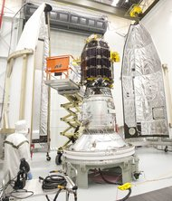

**To the Moon, Alice/Ladee?**

****

NASA is soon returning to the moon via a Smart Car–sized probe named “Ladee” for a 100-day study of its surface. Meant to self-destruct after delivering its findings, Ladee can be replicated for future missions. But in the absence of manned American missions, some U.S. scientists question Ladee’s relevance. Still, Ladee may have company, as China, India, Japan, Russia, and the European Space Agency all have unmanned lunar missions in the works. *—Jennifer Komar Olivarez, associate curator, *

*September 5*

**

Photo: Terry Zaperach/NASA, via Agence France-Presse — Getty Images

Source: CAROLINE CHEN, “New Moon Probe Raises Questions About What to Do Next in Space,” *New York Times*, August 31, 2013 

