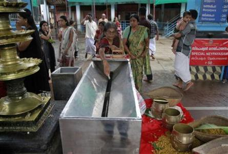

**Silence is golden?**

****

An Indian government query into the piles of gold being held in temples has been met with fierce umbrage. Such gold is stored by devotees as jewelry, bars, or coins.

Gold, precious the world over, serves in India as a hedge against inflation or to curry favor with the gods. But gold imports have exacerbated India’s current account deficit; its daily purchase is estimated at 2.3 tons, the weight of a diminutive Hummer. The World Gold Council cites about 2,000 tons—worth \$84B—locked away in temple vaults. That’s a lot of necklaces.

*      —Diane Richard, writer, October 2*

**

Photo: D. Jose

Source: “Gods forbid: India's temples guard their gold from government,” REUTERS, September 29, 2013 

