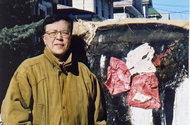

**A life imitating art?**

****

In an \$80 million scam that has rocked the East Coast gallery world, New York–based artist Pei-Shen Qian has vowed his innocence to painting knockoffs of works by the likes of Rothko, Pollock, and de Kooning. 

The artist scoffed at the notion that his imitations could be mistaken for the real deal. Yet 60 faux masterpieces by his hand were sold, most through the prominent gallery Knoedler & Co., now closed. The dealer pleaded guilty to the criminal activity, confirmed by forensic evidence. Perhaps if the shady middleman who allegedly snookered Qian had paid as close attention to the paintings’ backs as to their fronts, no one still would be the wiser.   —*Gail Marie Kern, Security Team, December 30*

**

w

Image: © 2013 The New York Times Company

Source: Dune Lawrence, Wenxin Fan, “The Other Side of an \$80 Million Art Fraud: A Master Forger Speaks,” *Bloomberg News*, December 19, 2013

