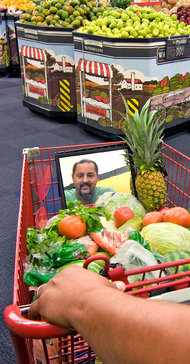

**Produce a Better Result?**

****

Next time you reach for a box of Pop Tarts, see if you can complete the task keeping a smile on your face. 

An experiment in healthier eating has taken over a few markets in El Paso. In hopes to coax shoppers into making better dietary choices, researchers have added mirrors and dividers to grocery carts, subtly suggesting a better ratio of produce to prepared foods. So far, consumers have doubled their veggie quotient. Whether they eat them, however, is anyone’s guess.

    *—Diane Richard, writer, August 29*

Photo: Bruce Berman for *The New York Times*

Source: MICHAEL MOSS, “Nudged to the Produce Aisle by a Look in the Mirror,” 

*New York Times*, August 27, 2013 

