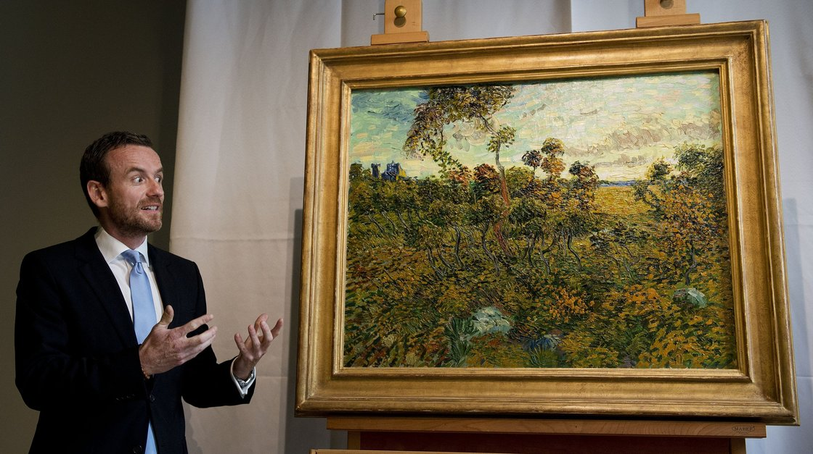

**Do you have a Van Gogh in your attic?**

****

Might want to check. Recently, a painting gathering cobwebs in a Norwegian attic was declared a genuine Van Gogh, increasing in value about 10 zillion percent.

Seems the painting had been declared a fake in the 1990s, largely because the mercurial artist had not signed it. Details, details. Other evidence confirms its authenticity as the long-lost *Sunset at Montmajour*, including a letter from Van Gogh to his brother describing the painting and when he painted it. It will be on display at the Van Gogh Museum, in Amsterdam, starting September 24.

*—Tim Gihring, editor*

*September 12, 2013*

* *

**

Source: npr.org, September 9, 2013

Photo: Olaf Kraak / AFP / Getty Images

