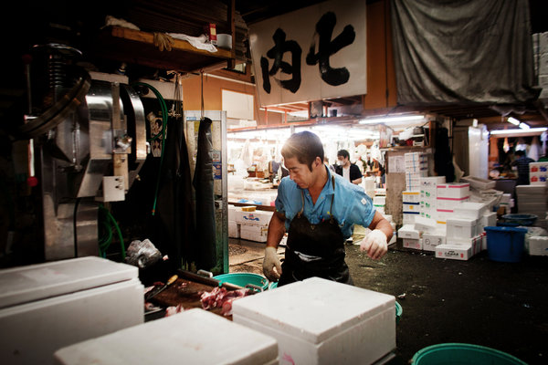

**Sushi market a go-go?**

****

It’s the epicenter of sushi, the slimy storehouse of prized tuna and pie-eyed tourists in Tokyo: the Tsukiji fish market. And it will shortly be moving from its cosmopolitan locale to a climate-controlled distribution center on a manufactured island.

The world’s largest fish market, Tsukiji occupies prime development land desired by city planners for the 2020 Olympics in Tokyo. But the move, estimated to cost \$4.5 billion, is yet another blow to a vanishing way of life, preservationists contend. *—Diane Richard, writer, September 19*

**

**

Photo: Ko Sasaki for *The New York Times* 

Source: MARTIN FACKLER, “A Way of Life Moves With a Market,” *New York Times*, September 17, 2013 

