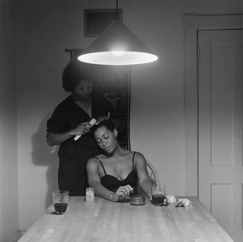

**Stroke of genius?**

****

The recently announced 2013 John D. and Catherine T. MacArthur Foundation “genius” grants are a huge coup for scientists, lawyers, and artists of all types.

Didn’t get the call? Be happy to know that Carrie Mae Weems, an artist and at 60 the oldest on the list, did. She—along with 23 other recipients—will have \$625,000 of unrestricted funds to pursue her art—or buy a villa. *—Diane Richard, writer, September 26*

**

**

Image: Carrie Mae Weems, courtesy of the artist and Jack Shainman, New York. From “The Kitchen Table Series.” 1990.

Source: FELICIA R. LEE, “24 Recipients of MacArthur ‘Genius’ Awards Named,” *New York Times*, September 25, 2013 

