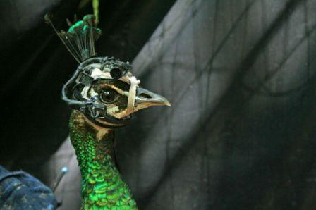

**Shake a tail feather?**

****

Scientists point to the idea of “sexual selection” to explain why peacocks have such ostentatious tail feathers. But what does that really mean to the hens themselves? Do they select mates based on size alone?

Biologists have now answered that question by tracking the eye movements of hens when males shake their stuff. Turns out it’s not what you got, but what you do with it: peacocks must go through a whole choreography of movements to keep the ladies interested. 

*—Alex Bortolot, Content Strategist, October 15*

**

Image: Photo by Jessica Yorzinski.

Source: Robin Anne Smith, ” Eye-Tracking Reveals What’s Hot, What’s Not from the Peahen’s Point of View,” *http://blogs.scientificamerican.com/*, 7/25/13 

