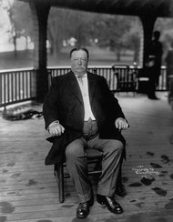

**Weight of the world?**

****

U.S. President William Taft was a yo-yo dieter with a weight-loss guru, personal trainer, and a surprisingly modern low-fat, low-cal daily regimen. Today, he might post blog updates to help him stay focused. But in his time, a dietary diary and letters recorded his cravings.

Researchers recently published in *The Annals of Internal Medicine*the findings of his struggles, noting his wins (down 60 pounds!) and frustrations (gaining it all back, plus). Teasing and tales about tight bathtubs didn’t stop him: he died dieting, at a relatively svelte 280 pounds.         *—Diane Richard, writer, October 15*

**

Photo: Corbis 

Source: GINA KOLATA, “In Struggle With Weight, Taft Used a Modern Diet,” *New York Times*, October 15, 2013 

