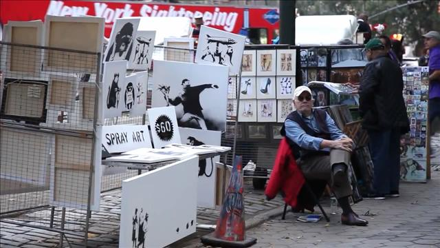

**What’s it worth to you?**

****

To Banksy, the anonymous U.K. artist, it was \$60. That’s how much he charged for each piece of signed artwork he sold at a one-day sale near Central Park. 

Ever tweaking the art establishment, Banksy made his retail debut during a month-long stint in NYC. His work, which has sold at auction for as much as \$1.87 million, brought in \$420 (eight paintings; 50% off for two). Much like a *ukiyo-e* print—once ephemeral, now collectible and valuable—his satirical stencil work raises questions about the vagaries of taste and context.

        *—Diane Richard, writer, October 16*

**

Source: Anna Russell, “A Bridge Between Western Science and Eastern Faith,” *Wall Street Journal*, October 14, 2013 

