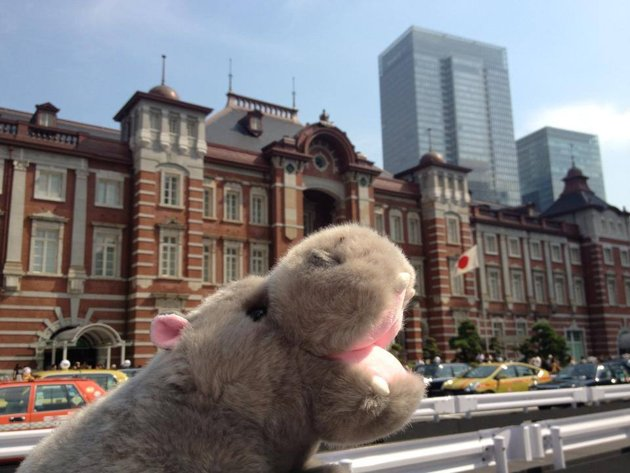

**Toys to Tokyo?**

****

Can’t make it to Narita with your Teddy bear in tow? The Unagi Travel company will take your stuffed toy on a grand adventure, without your having to lift a finger—except to reach for your wallet.

It’s an offering for the laziest of armchair travelers. For the cost of one-way postage to Japan (the return shipment is free), plus \$35 on up, your plush toy can see the sights: shopping districts, Buddhist temples, skyline views, even spas. Really, spas?    

  *—Diane Richard, writer, November 6*

**

Image: Courtesy of Unagi Travel

Source: Claudine Zap, “This company will send your stuffed animal on a vacation,” Compass, October 27, 2013 

