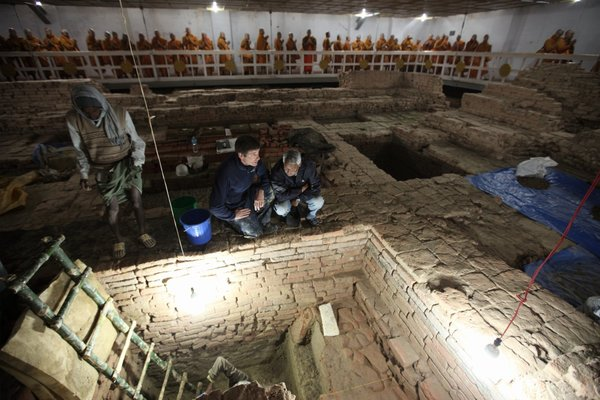

***Really* ancient wisdom?**

****

It’s one thing to fudge your birth year—but by 300 years? Archaeologists have recently unearthed a series of ancient temples beneath the birthplace of the Buddha, now a UNESCO site, in contemporary Nepal.

The discrepancy puts into debate the origins of one of the world’s central religions. Until now, evidence pointed to the third century BCE, when Emperor Asoka sent Buddhism throughout South Asia in honor of “the enlightened one.” Discovery of the new structures places his birth date as early as the sixth century BCE.

  *—Diane Richard, writer, November 26*

**

**

Image: Ira Block/National Geographic

Source: JOHN NOBLE WILFORD “New Clues May Change Buddha’s Date of Birth,” *The New York Times*, November 25, 2013 

