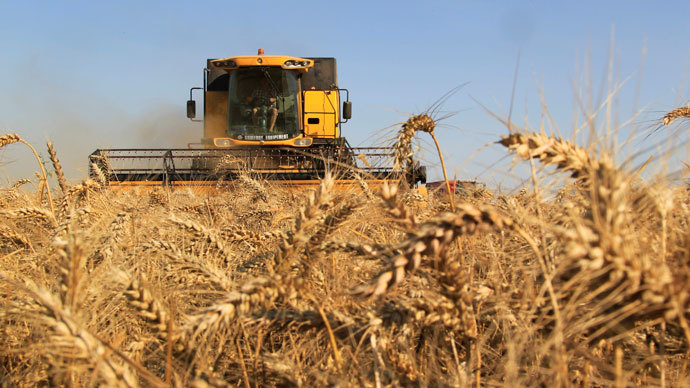

**Supremely Seedy?**

****

Monsanto wants to dominate the Corn Goddess. One of the largest distributors of genetically modified seeds in the world, the biotech behemoth has earned a reputation for suing farmers for saving seeds for later replanting without paying associated royalties. Monsanto’s aim? To protect its patents.

In September, farmers took their case to the U.S. Supreme Court, trying to create legal protections if Monsanto seeds blow into their fields and plant themselves. No ruling has been issued.

    —*Gail Marie Kern, Security Team, November 6*

**

Image: Reuters / Pascal Rossignol

Source: “US farmers challenging Monsanto patent claims appeal to Supreme Court,” *RT*, September 6, 2013 

