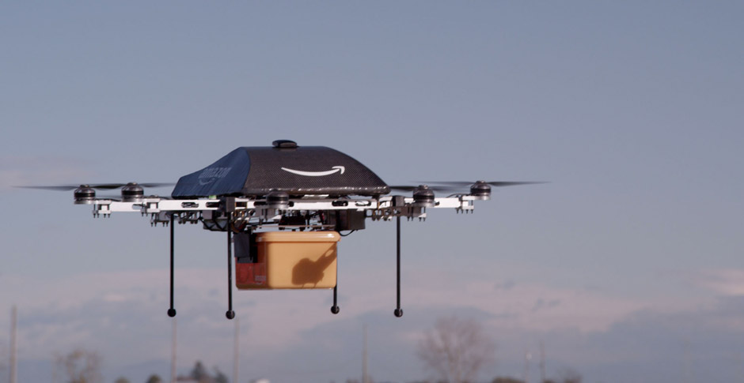

**Deliveries via drone?**

****

Just in time for Cyber Monday, when online shopping is discounted, Amazon announced that online orders will one day be delivered to your doorstep in 30 minutes or less—via drone. “Prime Air vehicles will be as normal as seeing mail trucks on the road today,” the company conjectured. Is this a joke? No. Science fiction? Maybe. Actually going to happen? That’s anyone’s guess. For now, we’re sticking with the good ole Pony Express.   

*—Emma Bauer, audience engagement assistant*

*December 4, 2013*

Source: Amazon.com

