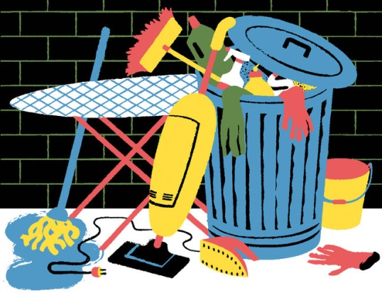

**The End of Housework?**

****

The sad truth is that “men’s time investment in housework has not significantly altered in nearly 30 years,” and women are still shouldering the better half (ahem) of domestic labor. But the good news is that standards for cleanliness shift over time: “Fifty years ago, it was perfectly normal to iron sheets,” writes Stephen Marche. To achieve “perfect egalitarian squalor” today, women just need to lower their standards to match those of their menfolk. Kirchner’s painting *Modern Bohemia* depicts the dream of men and women released from the drudgery of housework to pursue their creative potential. One wonders, though: Who beats those carpets to keep their colors bright, and who weeds the garden that grows those lovely flowers? 

*—Charisse Gendron, grantwriter, December 12*

**

Photo credit: Golden Cosmos

News source: Stephen Marche, “The Case for Filth,” *New York Times*, December 7, 2013

