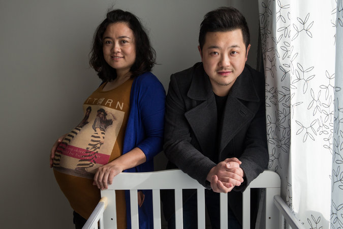

**China’s 2 for 1?**

****

In an easing of its one-child-per-family policy, China is now allowing certain parents to have two children. Married couples in which one member is an only child may now make room for two—or even twins.

After a generation of the policy, the reversal is bittersweet for some couples already struggling to pay school expenses for their singletons. The government hopes the change will encourage an additional 15–20 million couples to multiply, helping to offset a striking demographic imbalance in sex, where boys vastly outnumber girls.*  —Diane Richard, writer, February 26*

**

Image: Sim Chi Yin for *The New York Times*

Source: DAN LEVIN, “Many in China Can Now Have a Second Child, but Say No,” *New York Times*, February 26, 2014

