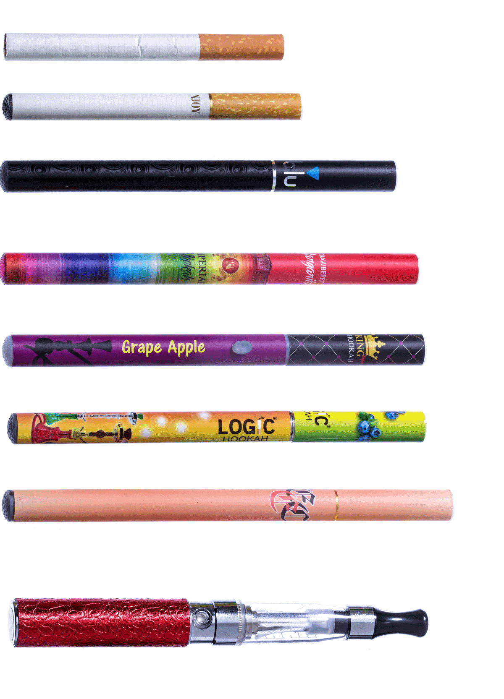

**Puffing stuff?**

****

Contemporary devices for smoking tobacco have emitted clouds of confusion. What was once simply a cigarette, cigar, or pipe now goes by many names: 

e-cigarette, e-hookah, hookah or vape pen, vape pipe.

**

The semantic problem is significant. In trying to understand the public health implications of the increasingly popular devices, particularly among young people, researchers are finding that subjects know their smokes by one name—and not another. So while they may demur on “vaping,” they neglect to share their daily dragging on an e-cig. No matter the name, the devices deliver potent levels of nicotine.*              —Diane Richard, writer, March 6*

**

**

Source: MATT RICHTEL, “E-Cigarettes, by Other Names, Lure Young and Worry Experts,” *New York Times*, March 4, 2014

