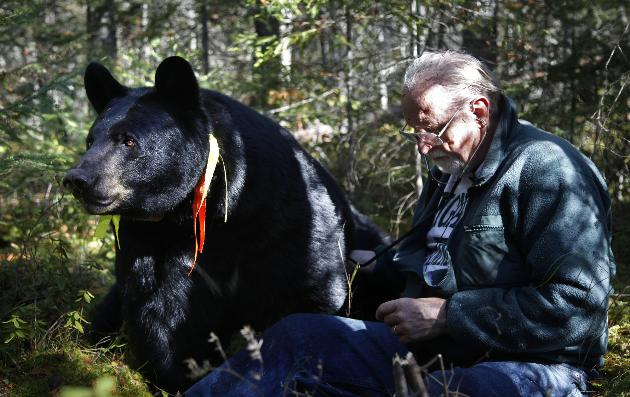

**Un-bear-able Research?**

****

The MN Department of Natural Resources and bear researchers in northern Minnesota are entering a grizzly court situation this week. Residents of northern Minnesota say the bears have become too docile and people-friendly as a result of hand-feeding by researchers, like Lynn Rogers, below, and locals. Bears have been begun creating panda-monium by expecting food from people—and refusing to leave.

Should the townfolk grin and bear it, or should the wild animals stay wild?     *—Roma Rowland, Administrative Assistant*

*Departments of Asian Art and Japanese & Korean Art*

*March 6*

Image: Brian Peterson, *Star Tribune*

News source: Associated Press, “Judge rejects Minnesota bear researcher's request to toss case; attorney says no permit needed,” *Star Tribune*, March 4, 2014

