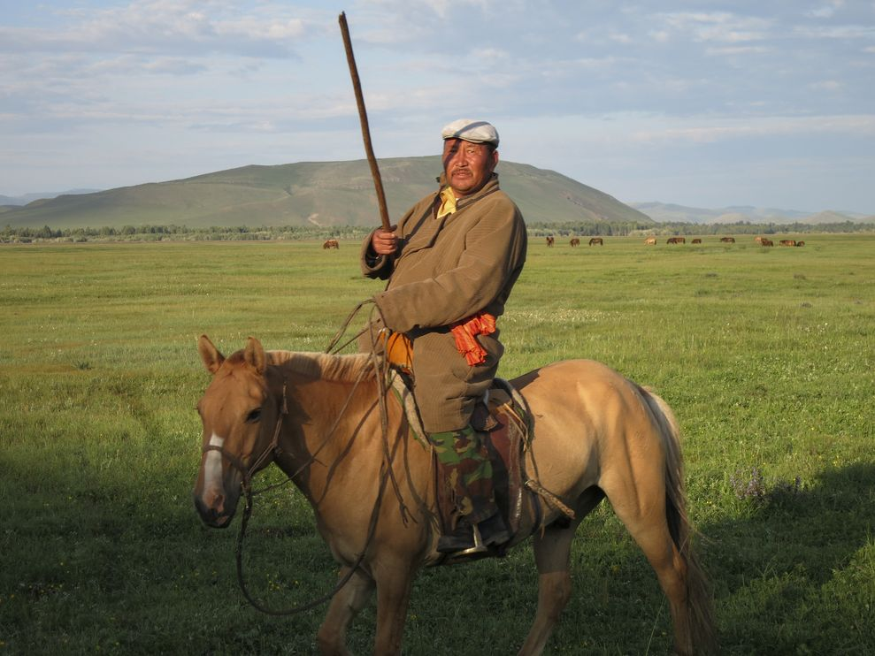

**Fair weather warrior?**

****

This serene funeral mask comes from a region known now as Mongolia, a desert land conquered by the great horseman Genghis Khan. Recent studies show that his conquest not coincidentally coincided with a spate of good weather.

Tree-ring samples revealed a 15-year run of lush rains and mild weather on the typically brisk, arid steppes. Such conditions allowed nomadic Mongol horsemen like Khan to sweep through much of Asia over a few decades 800 years ago, conquering everything in their path. *—Diane Richard, writer, March 12*

**

**

Image: Kevin Krajick/The Earth Institute, Columbia University

Source: Roff Smith, “Genghis Khan's Secret Weapon Was Rain,” *National Geographic,*March 10, 2014

